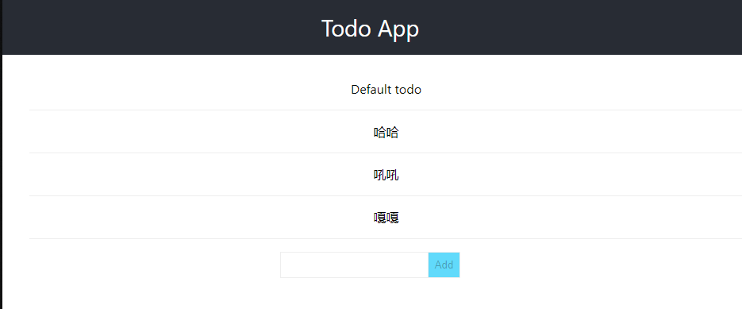

## Go SPA Demo

使用Go打包为二进制的React单页面应用；

编译二进制使用的库：

-   [rakyll/statik](https://github.com/rakyll/statik)


### 开发环境

-   Node
-   Golang 1.15
-   [rakyll/statik](https://github.com/rakyll/statik)
-   Makefile（可选）

>   由于需要使用[rakyll/statik](https://github.com/rakyll/statik)编译二进制；
>
>   所以需要提前安装：
>
>   **clone源码，go build，并把编译出的statik二进制加入系统变量Path即可！**


### 项目使用

#### **使用make命令编译**

如果开发环境已经存在make命令，可以在根目录下直接使用`make`命令编译整个项目：

```bash
$ make
cd web && yarn && yarn build && cd ..
statik -f -src=./web/build # use `-f` to override statik build
go build -o app main.go
yarn install v1.22.5
[1/4] Resolving packages...
success Already up-to-date.
Done in 0.46s.
yarn run v1.22.5
$ react-scripts build
Creating an optimized production build...
Compiled with warnings.

src\App.js
  Line 3:8:  'logo' is defined but never used  no-unused-vars

Search for the keywords to learn more about each warning.
To ignore, add // eslint-disable-next-line to the line before.

File sizes after gzip:

  42.19 KB  build\static\js\2.55a8d793.chunk.js
  1.57 KB   build\static\js\3.01417940.chunk.js
  1.17 KB   build\static\js\runtime-main.08b54c47.js
  1.04 KB   build\static\js\main.d5c45919.chunk.js
  624 B     build\static\css\main.668855c6.chunk.css

The project was built assuming it is hosted at /.
You can control this with the homepage field in your package.json.

The build folder is ready to be deployed.
You may serve it with a static server:

  yarn global add serve
  serve -s build

Find out more about deployment here:

  https://cra.link/deployment

Done in 4.67s.
```

编译完成后：web目录下产生前端编译结果build目录，statik目录下产生前端编译为二进制的go文件；

同时，根目录下产生整个项目的二进制文件：`app`；

>   **在windows下可能需要手动修改扩展名为`.exe`；**
>
>   **（可修改Makefile指定编译后的文件名）**

最后，运行编译后的文件：

```bash
$ ./app

   ____    __
  / __/___/ /  ___
 / _// __/ _ \/ _ \
/___/\__/_//_/\___/ v3.3.10-dev
High performance, minimalist Go web framework
https://echo.labstack.com
____________________________________O/_______
                                    O\
⇨ http server started on [::]:8080
```

打开后端服务器；

访问`localhost:8080`，结果如下：


添加多个Todo条目，结果：



同时后端输出日志：

```bash
{"time":"2021-03-28T21:26:30.6609505+08:00","level":"-","prefix":"echo","file":"main.go","line":"53","messa
ge":"Handle get"}
{"time":"2021-03-28T21:27:49.7780022+08:00","level":"-","prefix":"echo","file":"main.go","line":"57","messa
ge":"Handle post"}
{"time":"2021-03-28T21:27:52.6052245+08:00","level":"-","prefix":"echo","file":"main.go","line":"57","messa
ge":"Handle post"}
{"time":"2021-03-28T21:27:54.2510517+08:00","level":"-","prefix":"echo","file":"main.go","line":"57","messa
ge":"Handle post"}
```

成功！

<br/>

#### **手动编译**

如果没有make命令，可以根据Makefile中的构建顺序手动编译各个项目；

首先编译web目录下的前端应用：

```bash
$ cd web && yarn && yarn build && cd ..
```

随后将前端应用编译为go的二进制文件；

```bash
$ statik -f -src=./web/build
```

最后，编译go项目：

```bash
$ go build -o app main.go
```

>   **上述命令都是在项目的根目录执行的；**

可以获得同样的效果！


### 其他说明

更详细的说明可见文章：

-   Github Pages：[使用Go打包二进制React单页面应用](https://jasonkayzk.github.io/2021/03/28/%E4%BD%BF%E7%94%A8Go%E6%89%93%E5%8C%85%E4%BA%8C%E8%BF%9B%E5%88%B6React%E5%8D%95%E9%A1%B5%E9%9D%A2%E5%BA%94%E7%94%A8/)
-   国内Gitee镜像：[使用Go打包二进制React单页面应用](https://jasonkay.gitee.io/2021/03/28/%E4%BD%BF%E7%94%A8Go%E6%89%93%E5%8C%85%E4%BA%8C%E8%BF%9B%E5%88%B6React%E5%8D%95%E9%A1%B5%E9%9D%A2%E5%BA%94%E7%94%A8/)

